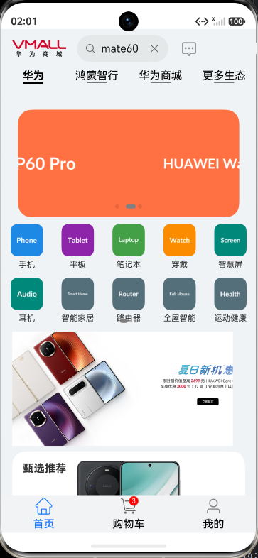
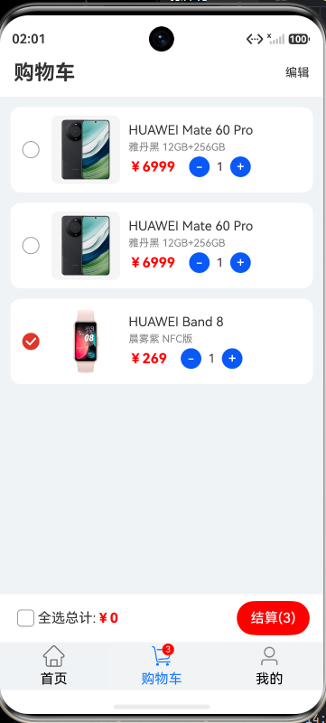

# 鸿蒙商城 App（HarmonyOS / ArkTS / ArkUI）

基于 HarmonyOS Stage 模型与 ArkTS、ArkUI 开发的商城类应用，覆盖首页浏览、商品详情、规格选择、购物车、登录注册等主要购物流程。商品与用户数据通过 HTTP 请求本地 json-server Mock 服务获取，登录态与购物车数据使用 Preferences 做本地持久化。

这是一个个人练习项目，目的是熟悉 HarmonyOS 应用的整体开发流程：页面与状态管理、网络请求分层封装、本地数据持久化，以及 ArkTS 的静态类型写法。

## 功能

- 首页：底部 Tab（首页 / 购物车 / 我的），包含搜索、轮播图、快捷入口、新人福利、分类专区与「猜你喜欢」推荐列表，滚动到底部自动加载下一页，并提供一键回到顶部
- 商品详情：商品图集滑动、颜色与版本规格选择、加入购物车、评价与推荐商品
- 购物车：数量增减、删除、单选与全选，按选中项统计件数和金额，Tab 上有角标提示
- 登录注册：手机号校验、验证码倒计时、密码强度校验，注册分「手机号」「设置密码」两步
- 个人中心：展示登录后的用户信息，支持退出登录
- 本地持久化：登录用户信息与购物车数据写入 Preferences，应用重启后仍可恢复

## 界面预览

| 首页 | 商品详情 |
| :---: | :---: |
|  |  |
| **首页：分类入口与「猜你喜欢」推荐流** | **商品详情：颜色 / 版本规格选择** |
|  |  |
| **购物车：多选、数量增减与金额统计** | **登录：手机号与密码校验** |

## 技术栈

| 项 | 说明 |
| --- | --- |
| 开发框架 | HarmonyOS Stage 模型、ArkTS、ArkUI（声明式 UI） |
| 网络 | `@ohos.net.http`，统一封装在 `HttpService` 中 |
| 本地存储 | `@ohos.data.preferences`，统一封装在 `PreferenceUtils` 中 |
| 序列化 | `@kit.ArkTS` 的 `JSON`，用于对象与字符串互转 |
| 页面路由 | `@kit.ArkUI` 的 `router` |
| 后端 Mock | json-server（`mock/`） |
| 开发环境 | DevEco Studio、HarmonyOS SDK 6.1.1(24)，runtimeOS 为 HarmonyOS |
| 目标设备 | phone / tablet / 2in1 |

## 目录结构

```text
ELM
├── AppScope/                    应用级配置与图标
├── entry/                       主模块
│   └── src/main/
│       ├── ets/
│       │   ├── pages/           页面：Index（首页）、ProductDetail、ProductImage、
│       │   │                    Login、RegisterPhone、RegisterPassword、ConfirmOrder
│       │   ├── components/      可复用组件：GuessYouLike
│       │   ├── services/        业务与网络层：HttpService、UserService、CartService
│       │   ├── models/          数据模型：CartItem（含 fromJSON 转换）
│       │   ├── types/           接口类型定义：Product、UserInfo、HttpResponse 等
│       │   ├── utils/           工具类：PreferenceUtils
│       │   ├── config/          页面静态配置与常量
│       │   ├── entryability/    UIAbility 入口，应用启动与窗口设置
│       │   └── entrybackupability/
│       ├── resources/           图片、颜色、字符串等资源
│       └── module.json5         模块配置（含 ohos.permission.INTERNET 申请）
├── mock/                        json-server 数据与中间件
│   ├── db.json                  接口数据
│   ├── server.js                统一响应格式的中间件
│   └── public/images/           商品图片静态资源
├── screenshots/                 应用运行截图（README 界面预览使用）
├── build-profile.json5
└── oh-package.json5
```

## 架构说明

项目按「页面 → Service → 数据源」分层，页面只负责渲染和交互，不直接调用网络接口或读写 Preferences。

- **网络层 `HttpService`**：把 `@ohos.net.http` 的 GET / POST / PUT / DELETE 封装成静态方法，统一设置请求头、连接与读取超时（10 秒），并把异常情况兜底成 `{ code: -1, success: false }` 的返回结构，页面无需再写 try/catch。
- **统一响应结构**：Mock 服务的中间件会把数据包装成 `{ code, message, data, success }`，与 `types/HttpResponse` 对应，页面拿到的数据结构始终一致。
- **业务层**：`UserService` 负责登录用户信息的读写，`CartService` 负责购物车的增删改查与合并（同一商品、相同颜色和版本会自动累加数量）。
- **持久化**：`PreferenceUtils` 封装了 Preferences 的 put / get / delete，业务层通过 `JSON.stringify` / `JSON.parse` 完成对象与字符串的互转。
- **状态管理**：页面使用 `@State`、`@Prop`、`@Link`、`@Provide`、`@Consume` 驱动 UI 更新，例如购物车数量变化会同步刷新 Tab 角标与金额统计。

## 本地运行

1. 用 DevEco Studio 打开项目根目录，等待依赖同步完成（SDK 版本 6.1.1(24)）。

2. 启动 Mock 服务（需要 Node.js）：

   ```bash
   npx json-server@0.17.4 --watch mock/db.json --middlewares mock/server.js --static mock/public --port 3000
   ```

   启动后可访问 `http://localhost:3000/products` 验证接口是否正常。

3. 修改接口地址：`entry/src/main/ets/services/HttpService.ets` 中的 `BASE_URL` 目前写的是局域网 IP，请改成运行 Mock 服务那台电脑的局域网 IP（模拟器或真机需要与电脑在同一网络下）。

4. 把 `mock/db.json` 中图片地址（`http://…:3000/images/…`）里的 IP 一并换成同一个地址，否则首页和详情页的图片无法显示。

5. 运行 `entry` 模块即可。

> 提示：项目里有两处硬编码的局域网 IP（`HttpService.ets` 的 `BASE_URL` 与 `mock/db.json` 的图片地址），克隆后需要先替换。后续计划把它抽成统一配置。

## 后续计划

- 把接口地址、超时等抽到统一配置文件，去掉硬编码 IP
- 完善订单确认、地址管理、搜索等模块
- 补充单元测试与 UI 测试用例
- 商品、购物车等模块改用更完整的 ArkTS 类型定义

## 说明

项目中的商品图片、文案素材来自公开网络，仅用于个人学习，如有侵权请联系删除。
